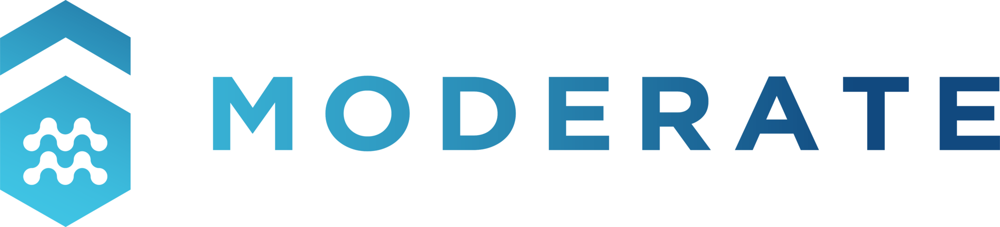

# Benchmarking tool 

The tool is designed to evaluate the energy performance and comfort levels of various monitored buildings. The data is structured as follows:

- **Metadata**:
Information related to the area, location, number of sensors, etc., for the different buildings is described using the BrickSchema ontology. The resulting files, in TTL format, are uploaded into an RDF structure using Python's rdflib library. These metadata are made accessible through a dedicated API developed in Python using FastAPI.

- **Time-series Data**:
Temporal data is stored in a TimescaleDB, which is made available through an API at the following address: `http://193.106.182.151/store_data/api/docs#/`. Access requires authorization, which can be requested via email at `daniele.antonucci@eurac.edu`. The schema and details about the time-series dataset are available in the timescaledb folder.

- **Application**:
The application is developed using [Dash plotly](https://dash.plotly.com/) and includes components from the [Dash Mantine Components](https://www.dash-mantine-components.com/) library.

## How it works?:
The application is divided into the following sections:

**Building**:
Displays the latest sensor readings for each monitored building as well as the building's location. From this section, users can navigate to either the `Analysis/Comfort` or `Anomalies` section.

**Processing**:
In this section, users can upload new data, detect, visualize, and remove outliers, and upload the cleaned data back to a sensor. This can be done using the BrickLLM library. Additionally, users can visualize the building graph, showing the different components and their relationships.

**Benchmarking**:
This section provides global-level indicators and analyses for all buildings based on the available data. Users can also compare two buildings side by side.

**Analysis**:

- Comfort: Evaluates the building's internal comfort using specific indicators and visualizations.
- Energy: Assesses the building's energy performance using specific KPIs and visualizations.
- Anomalies: For each building and sensor, potential outliers are detected using statistical evaluations based on clustering algorithms like DBSCAN and statistical methods such as Z-Score.

# Installation

# Deploying in VM using docker
Use docker to deploy the tool in a VM. Create and use a docker container:

1. build dev docker image both for backend and frontend. Change the name of the image both for backend and frontend.
``` bash 
    cd backend
    docker build -t imagename_backend:tag .  
    cd frontend_mantine
    docker build -t imagename_frontend:tag .
```
if your operation system is MACOS and the platform to be deployed the tool is linux, you have to use the following command to build the images

```bash
docker build -t platform=linux/amd64 -t imagename_backend:tag 
docker build -t platform=linux/amd64 -t imagename_frontend:tag 
```

2. in docker-compose.yml change the name of the images according to the name defined in the dockerfile both for frontend and backend.

`docker-compose.yml`
``` bash
    services:
  web:
    image: imagename_backend    
    command:  gunicorn -w 3 -b :8099 app:server
    ports:
      - 8099:8099
    env_file:
      - .env
    depends_on:
      - backend
    extra_hosts:
      - "host.docker.internal:host-gateway"


  backend:
    image: imagename_frontend
    command: uvicorn main:app --host 0.0.0.0
    ports:
      - "8000:8000"
    env_file:
      - .env
```

Now run the command:
`Window`
```bash
docker-compose up 
```


## On-premises

It is recommended to use a virtual environment such as Pipenv or Pyenv. For example: 

``` bash
    pipenv shell --python 3.12.6
    pipenv install
    source $(pipenv --venv)/bin/activate
```

The tool is currently tested with Python 3.12.6. After installing the required libraries using the command both for backend and frontend:

``` bash
pip install -r requirements.txt
```

### Backend
Run FastAPI: 

``` bash 
cd  backend
python  -m uvicorn main:app --reload 
```
### Frontend
to Run the frontend locally (without docker) the following steps should be follow:

- Update the .env file with the credentials to access to the API (ask to the `daniele.antonucci@eurac.edu`). Use the .env copy and change the name in .env 
- Uncomment the following lines in globals.py:

```bash
from dotenv import load_dotenv
load_dotenv()
```
- Run application

``` bash
cd frontend_mantine
python app.py
```

## Contributing and support 
Bug reports/Questions If you encounter a bug, kindly create a GitLab issue detailing the bug. Please provide steps to reproduce the issue and ideally, include a snippet of code that triggers the bug. If the bug results in an error, include the traceback. If it leads to unexpected behavior, specify the expected behavior.

Code contributions We welcome and deeply appreciate contributions! Every contribution, no matter how small, makes a difference. Click here to find out more about contributing to the project.

# License
Free software: MIT license

# Contacts
For any question or support, please contact: 
- Daniele Antonucci daniele.antonucci@eurac.edu 
- Olga Somova olga.somova@eurac.edu

## 💙 Acknowledgements
This work was carried out within European projects: 

<p align="center">
  
</p>

Moderate - Horizon Europe research and innovation programme under grant agreement No 101069834, with the aim of contributing to the development of open products useful for defining plausible scenarios for the decarbonization of the built environment

